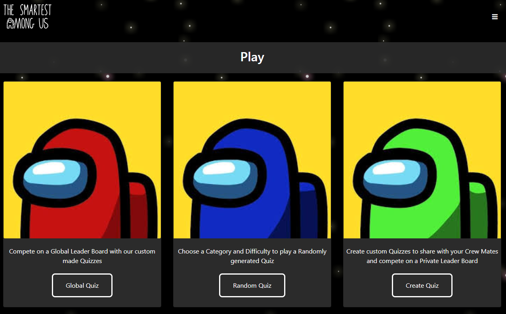

# The-Smartest-Among-Us-Refactor

[](https://github.com/diegopie/The-Smartest-Among-Us)
[](https://github.com/diegopie/The-Smartest-Among-Us)
[](https://opensource.org/licenses/MIT)



## Description

Talk about using the site and whatnot

&NewLine;
&NewLine;

## Table of Contents

- [Development](#Development)
- [Bugs](#Bugs)
- [Future Development](#Future-Development)
- [Contributors](#Contributors)
- [Contact](#Contact)
- [Reference Material](#Reference-Material)
- [License](#License)

## Development

- [Technology Overview](#Technology-Overview)
- [Installation](#Installation)
- [Dependencies/Packages](#Dependencies/Packages)
- [Server](#Server)
- [Client](#Client)

### Technology Overview

&NewLine;
&NewLine;

```sh
Frontend – Handlebars, Bootstrap,  
Backend – Node, Express
Database – mySQL, Sequelize
Authentication – Express-session, passport-local, bcrypt
```

### Installation

If you'd like to play with this code you may fork this repo and run on your machines. You will need [node.js](https://nodejs.org/en/) and [mySQL](https://dev.mysql.com/downloads/mysql/) installed. Outside of cloning the project and installing the dependencies, there are a few things to take care of to get the app running.

- Create a mySQL database named quizapp
- run server.js in a node environment to create all the necessary SQL tables

Next is setting up the global quizzes. I plan to change this in the [future](#Future-Development), but to use the globally accessible quizzes we first need to create a user in the db, known as global, then create the quizzes using this first user as the creator. It's not very efficient but it allows us to write global leaderboards to the server and do server-side updates to the quizzes. I do all this in [Postman](https://www.postman.com/downloads/)

- To create the initial, global user, make a POST request to localhost:8080/api/user with raw JSON. The needed JSON can be found in db/seeds/user.json

`{
  "username":"global",
  "password": "impstr"
}`

- Now the quizzes can be created and assigned to this first user. Make a POST request to localhost:8080/api/quiz with raw JSON. Our JSON quiz files can be found in db/seeds/HKquiz.json and AUquiz.json, but you can create your own as well using this same setup. A template of how quizzes are stored in the database can be found in that same folder under quiz.json


&NewLine;
&NewLine;

### Dependencies/Packages

&NewLine;
&NewLine;

| | | | |
| ------ | ------ | ------ | ------ |
| [bcryptjs](https://www.npmjs.com/package/bcryptjs) |  [dotenv](https://www.npmjs.com/package/dotenv) | [express](https://www.npmjs.com/package/express) |
| [express-handlebars](https://www.npmjs.com/package/express-handlebars) | [express-session](https://www.npmjs.com/package/express-session)  | [mysql2](https://www.npmjs.com/package/mysql2) |
| [passport](https://www.npmjs.com/package/passport) | [passport-local](https://www.npmjs.com/package/passport-local)  | [sequelize](https://www.npmjs.com/package/sequelize) |
|

&NewLine;
&NewLine;

#### Dev Dependencies

&NewLine;
&NewLine;

| | | | |
| ------ | ------ | ------ | ------ |
| [eslint](https://www.npmjs.com/package/eslint) | [eslint-config-prettier](https://www.npmjs.com/package/eslint-config-prettier) | [eslint-plugin-prettier](https://www.npmjs.com/package/eslint-plugin-prettier)|
| [nodemon](https://www.npmjs.com/package/nodemon) | [prettier](https://www.npmjs.com/package/prettier) |

&NewLine;
&NewLine;

> [Back To Development](#Development) || [Back To Table of Contents](#Table-of-Contents)

### Server

- [Database](#Database)
- [Routes](#Routes)
- [Authentication](#Authentication)

#### Database

&NewLine;
&NewLine;

We use a SQL database to service our application, with mySQL and mySQL Workbench being our interface of choice.


#### Routes

This app relies on dozens of API routes to manage each feature. They too are exported from an index.js file for simplicity. Obviously, each file using API routes for that specific feature. auth is shorthand for authenticated user and manages login, signup, search, etc.

#### Authentication

Express-session, Passport, Passport-Local Strategy, bcryptjs

### Client

We use react.js to build our front-end interface. We have custom linting rules beyond what react defaults with and a basic service worker to manage the PWA usage.

## Future Development

We have a lot planned for the future of this application. This MVP was built as a school project but we aim to continue working on this to enjoy with our friends! We use Jira to organize our development time and have our next sprint planned out. Here are some highlights

## Contributors

We are a small team who just recently began coding as part of the University of Utah's Coding Bootcamp. Our goal for this project to be ambitious, to take just 7 short week of development time and create an application that is unique. Something that forced us to learn well beyond our skills at the time. We are passionate about coding and are eager to continue to develop our skills.

 Diego Hernandez || [GitHub](https://github.com/Diegopie) || [LinkedIn](https://www.linkedin.com/in/diego-hernandez-7327381b2/)

 Diana Schull || [GitHub](https://github.com/dianalynshull)

 Bing Z. || [GitHub](https://github.com/imbingz)

## Contact

If you have any feedback our questions, please reach us at diegopie@outlook.com!

## License

This project is [MIT](https://choosealicense.com/licenses/mit/) licensed
